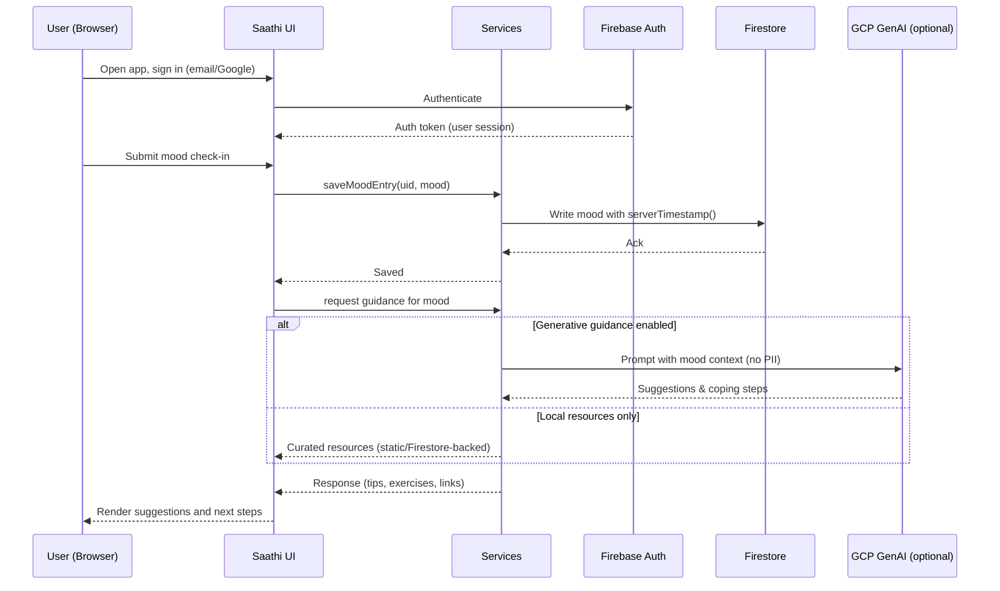

## Generative AI for Youth Mental Wellness – Problem, Solution, and Architecture

This repository implements “Saathi – Wellness Friend,” a confidential web application designed for the GENAI challenge: Generative AI for Youth Mental Wellness in India.

### Problem Statement (Context)
Young adults in India face high academic and social pressure but have limited access to affordable, stigma‑free mental health support. Professional services are scarce or costly, and cultural taboos discourage help‑seeking. Youth need a private, always‑available, non‑judgmental companion that offers evidence‑informed guidance, self‑help resources, and seamless hand‑offs to professional help when needed.

### Solution Overview (What we built)
Saathi is a client‑first, privacy‑aware wellness companion that:
- Provides a friendly UI for daily check‑ins, mood tracking, and self‑guided practices (breathing, grounding, micro‑meditations).
- Offers empathetic, resource‑oriented conversational support (client‑side orchestration, server‑side or cloud‑hosted model endpoints as needed).
- Stores minimal structured data (moods, chats metadata) in Firebase with user consent; no admin credentials are embedded in the client.
- Integrates Firebase Authentication for private, account‑scoped data and recovery.
- Emphasizes transparency, opt‑in analytics, and easy credential rotation.

### What’s used (Core stack)
- React 18, TypeScript, Vite 5
- Tailwind CSS, Radix UI, Lucide icons
- React Router, TanStack Query
- Firebase Web SDK: Auth, Firestore, Storage, (optional) Analytics
- Optional: Google Cloud endpoints for generative features (not embedded as credentials in client)

---

## System Architecture

```mermaid
flowchart LR
  user([Youth User – Browser])
  subgraph Client [Saathi Web App (React + Vite + TS)]
    UI[UI Components (Radix + Tailwind)] --> Pages[Pages & Routing (React Router)]
    Pages --> Hooks[Custom Hooks]
    Hooks --> Services[Services Layer]
    Services --> Lib[Config & Utilities]
  end

  subgraph Firebase [Firebase Project]
    Auth[Auth]
    FS[(Firestore)]
    Storage[Storage]
    Analytics[(Analytics – optional, opt‑in)]
  end

  user <--> UI
  Services <--> Auth
  Services <--> FS
  Services <--> Storage
  Services -.optional telemetry-.-> Analytics

  subgraph GCP [Google Cloud (optional)]
    GenAI[Generative AI Endpoint]
  end

  Services <--> GenAI
```

Key design choices
- Client‑first: The browser holds session state; sensitive admin keys are never shipped.
- Clear boundaries: UI/Pages are presentation; Hooks orchestrate state; Services isolate integration; Config centralizes env.
- Progressive privacy: Only user‑approved data is stored; per‑user isolation via Firebase Auth; telemetry is opt‑in.

---

## Interaction Flow – Mood Check‑in and Guidance



---

## Data Model (Firestore)
- `users/{uid}`: profile, preferences (theme, language, notifications), wellness summary
- `moods/{id}`: uid, mood parameters, timestamp
- `chats/{id}`: uid, role, content, timestamp

The code implementing these operations is in:
- `src/config/firebase.config.ts` – initializes Auth, Firestore, Storage, Analytics
- `src/services/firebase.service.ts` – authentication, user profile, mood tracking, chat history

---

## Setup and Configuration
Prerequisites: Node.js 18+ and a Firebase project.

1) Install
```bash
cd saathi-wellness-friend
npm install
```

2) Configure environment
Copy `.env.example` to `.env` and fill values:
```env
VITE_FIREBASE_API_KEY=
VITE_FIREBASE_AUTH_DOMAIN=saathi-78df6.firebaseapp.com
VITE_FIREBASE_DATABASE_URL=https://saathi-78df6-default-rtdb.firebaseio.com
VITE_FIREBASE_PROJECT_ID=saathi-78df6
VITE_FIREBASE_STORAGE_BUCKET=saathi-78df6.firebasestorage.app
VITE_FIREBASE_MESSAGING_SENDER_ID=
VITE_FIREBASE_APP_ID=
VITE_FIREBASE_MEASUREMENT_ID=
```
Do not commit `.env` or any credentials. They are ignored by `.gitignore`.

3) Run locally
```bash
npm run dev
```

4) Build/Preview
```bash
npm run build
npm run preview
```

---

## Engineering Practices
- TypeScript strict mode and ESLint enforced
- Path alias `@/` for maintainable imports
- React Router for routing, TanStack Query for server‑state
- Radix primitives + Tailwind for accessible, consistent UI

---

## Security, Privacy, and Stigma Sensitivity
- Least‑data: store only what is necessary for features; keep PII out of prompts.
- Client credentials only; no admin/service keys in the web client.
- Rotate keys and revoke if exposed; never commit secrets.
- Provide clear language, neutral tone, and immediate access to professional resources and crisis links.
- Logically separate user data by UID; enable export/delete workflows as needed.

---

## Deployment Options
- Static hosting (Netlify, Vercel, GitHub Pages, Firebase Hosting)
- Backend endpoints (if needed for GenAI) should sit behind authenticated APIs on GCP (Cloud Run/Functions) and never expose service accounts to the client.

---

## License
Proprietary — all rights reserved unless otherwise stated by the repository owner.
